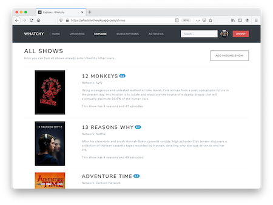
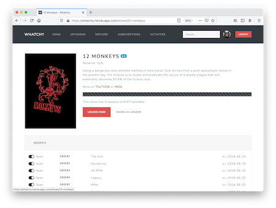

# Whatchy

Rails app to track tv shows / series.

It gets it's data from [TheTVDB.com](https://www.thetvdb.com).

## Screenshots

All Shows

[](docs/screenshot_explore.png)

Show Details

[](docs/screenshot_show.png)

## Configuration

The following environment variables are available:

| Name                  | Mandatory |          Default          | Description                                                 |
| --------------------- | :-------: | :-----------------------: | ----------------------------------------------------------- |
| `AIRBRAKE_PROJECT_ID` |     -     |            999            | Project ID on [airbrake.io](https://airbrake.io)            |
| `AIRBRAKE_API_KEY`    |     -     |     airbrake-api-key      | API key for [airbrake.io](https://airbrake.io)              |
| `BANNER_CACHE_HOST`   |     -     | https://cache.example.com | Host serving the images provided by [thetvdb.com][thetvdb]. |
| `DATABASE_URL`        |     x     |             -             | Database credentials in URL format.                         |
| `DOMAIN`              |     -     |             -             | Domain used for mail sender-address and links.              |
| `SMTP_ENABLED`        |     -     |             -             | Sending mails via SMTP (`true`/`false`).                    |
| `SMTP_SERVER`         |     -     |             -             | Hostname of the mail server.                                |
| `SMTP_PORT`           |     -     |            587            | Port of the mail server.                                    |
| `SMTP_USERNAME`       |     -     |             -             | Username for the mail server.                               |
| `SMTP_PASSWORD`       |     -     |             -             | Password for the mail server.                               |
| `RAILS_LOG_TO_STDOUT` |     -     |             -             | Log to process standard out (`true`/`false`).               |
| `THETVDB_APIKEY`      |     x     |             -             | API key for [thetvdb.com](https://thetvdb.com).             |

## Deployment

By default the application is designed to run at [Heroku](https://www.heroku.com).

In addition to the default `web` process defined in the `Procfile` a cronjob is required to be defined in the [Heroku Scheduler](https://devcenter.heroku.com/articles/scheduler):

```
rake crons:daily
```

## Licence

The application is available as open source under the terms of the MIT License.
